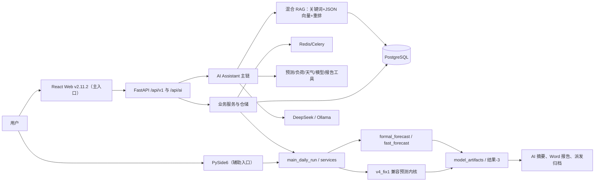
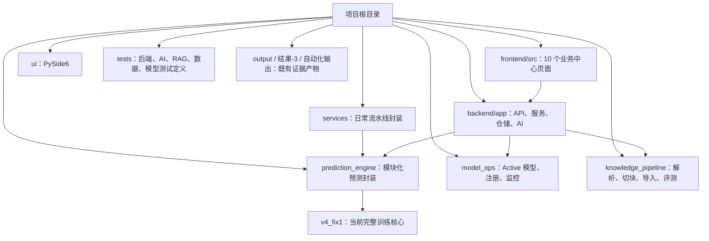

# 智能运营分析项目：阶段一全量盘点与证据基线

基线日期：2026-07-14  
审计方式：只读静态审计 + 只读数据库查询 + 既有产物/日志交叉核验  
项目根目录：`E:\智能运营分析项目`

> 状态仅使用：`completed_verified`、`completed_unverified`、`partially_completed`、`implemented_not_integrated`、`planned_only`、`not_started`、`blocked`、`deprecated`、`duplicate`、`unable_to_verify`。本报告不以历史文档声明替代代码、调用、数据、日志或测试证据。

## 1. 执行摘要

项目已从单体预测脚本演进为“React Web + FastAPI + PostgreSQL + Redis/Celery + Python 预测流水线 + AI/RAG + PySide6”的模块化单体系统。当前产品版本号为 **v2.11.2**，用户主入口应为 Web 平台；完整训练仍由模块化服务动态加载 `高峰尖刺增强版_电力市场电价预测与智能分析系统_v4_fix1.py`，因此尚未完成预测内核的彻底模块化。

最可靠的已完成能力是：数据采集/清洗代码与两年期数据、按时间切分及防泄漏检查、完整模型产物、2026-06-18 的 24 小时正式预测、本地报告归档、FastAPI/React 路由骨架、新 AI 助手工具—LLM—Guard 主链及混合 RAG 实现。当前不能认定为生产闭环：数据库 `forecast_results`、`model_registry`、`report_runs` 等为空，数据库模型中心为种子数据且无 Active 模型；当前仅 PostgreSQL 端口可用，后端、前端、Redis、Ollama均未运行；Celery 模式下数据刷新日志已出现 Redis 超时和 HTTP 500。

综合判断：项目处于 **功能广度较完整、工程集成尚未闭环的 P5/P6 过渡阶段**，总体状态为 `partially_completed`。

## 2. 审计范围

覆盖根目录、`backend`、`frontend`、`prediction_engine`、`model_ops`、`services`、`knowledge_pipeline`、`tests`、`migrations`、`ui`、模型/预测/报告产物、启动与部署脚本、Git 元数据、PostgreSQL 结构与关键表计数。排除 `.git` 对象、虚拟环境、`node_modules`、缓存、构建产物、第三方模型二进制内容和大型数据全文。

未执行完整采集、训练、预测、知识库导入、测试套件、前后端构建或任何会写数据库/覆盖产物的流程；未输出敏感值。

## 3. 实际检查规模

- 建立索引：5,162 个文件、294 个含文件目录；另识别 `.venv`、`node_modules`、模型目录等排除项。
- 主要文件类型：Markdown 2,284、JSON 484、日志 475、PNG 396、Python 348、XLSX 293、YAML 202、JSONL 158、DOCX 91、CSV 71、TSX 52、TS 33、Joblib 30、SQL 14。
- Python AST：348 个项目 Python 文件，0 个语法错误。
- 测试定义：64 个 Python 测试文件；本阶段未运行测试。
- PostgreSQL：连接成功；迁移版本 `0012_backend_legacy_tables`；58 张表；采用只读事务查询关键表。
- Git：分支 `p5-frontend-ai-experience`，HEAD `f8dc0bc`（2026-06-25）；本地领先远端 10 个提交；审计开始时 386 条工作区状态（86 modified、300 untracked），差异约 14,686 insertions/4,166 deletions。
- 大型资产：最大两个历史 `peak_model.joblib` 各约 434.2 MB；另有 57.5 MB Git bundle、52.6 MB 云端包及 22.6 MB 特征表。

## 4. 项目真实技术架构

前端为 React 18、TypeScript、Vite、Ant Design、ECharts；后端为 FastAPI、SQLAlchemy/原生 SQL 仓储、PostgreSQL；异步任务设计为 Redis/Celery；预测侧使用 pandas、scikit-learn，并保留 XGBoost/LightGBM 可选依赖；AI 侧为 DeepSeek/Ollama Provider、工具编排、Answer Guard、BGE embedding/reranker；桌面端为 PySide6，旧 Tkinter 仍保留。数据库配置名仍有 MySQL 历史痕迹，但当前 `.env` 和实际连接均为 PostgreSQL。

## 5. Mermaid 总体架构图

## 6. Mermaid 目录与模块关系图

## 7. 项目版本沿革

1. 旧单体预测脚本 `优化版...v2.py`、`彻底去泄漏版...v3.py`、`...v4.py` 已被替代，状态 `deprecated`。
2. `v4_fix1.py` 仍被 `prediction_engine/legacy_engine.py`、特征/训练/正式预测模块调用，属于当前兼容内核，不是纯历史文件。
3. `prediction_engine`、`services`、`model_ops` 建立了模块化封装，但完整训练尚未脱离 v4_fix1。
4. 桌面端由旧 Tkinter 迁移至 PySide6；随后建立 FastAPI/React Web。
5. AI 同时保留旧 `backend/app/ai`、`backend/langgraph_agent` 和新 `backend/app/ai_assistant`。旧入口函数在首个 `return answer_chat_accurate(...)` 后仍有不可达旧代码，形成重复实现。
6. 知识库由本地脚本演进为 PostgreSQL `kb_documents/kb_chunks` + BGE + 混合检索，但当前库内容已与历史导入规模不一致。

## 8. 当前主版本判断

- 产品版本：`v2.11.2`（后端 `APP_VERSION`、前端 `package.json`、启动脚本一致）。
- 当前 Git 代码线：`p5-frontend-ai-experience`；工作区包含大量未提交的新变化，不能把 HEAD 等同当前磁盘版本。
- 训练主入口：`main_daily_run.py` / `services.prediction_service.run_prediction` → `prediction_engine.legacy_engine` → `v4_fix1.py`。
- 快速预测入口：`main_daily_run.py --refresh-data --fast-forecast` → `services.prediction_service._run_fast_forecast` → `prediction_engine.fast_forecast.forecast_with_saved_model`。
- 后端入口：`uvicorn backend.app.main:app`，由 `scripts/web_platform_launcher.py`/启动 BAT 调度。
- 前端入口：`frontend` 下 `npm run dev`（Vite）。
- AI 聊天接口：`POST /api/ai/chat` 和流式 `/api/ai/stream` → `backend.app.ai.assistant_service.answer_chat` → `backend.app.ai_assistant.service.answer_chat_accurate`。
- RAG 入口：`backend.app.services.rag_service.search_knowledge`，并由真实聊天主链按意图触发。
- 桌面端入口：`python -m ui.app`；旧 `gui_launcher.py` 为 `deprecated`。
- 用户实际应启动：`run_web_platform.bat` / `scripts/web_platform_launcher.py` 对应的 Web 系统；PySide6 仅作为本地辅助控制台。

## 9. 当前主启动方式

`run_project.bat` 是统一菜单；Web 推荐 `run_web_platform.bat`。日常数据刷新与快速预测由菜单调用 `run_daily_pipeline_refresh_fast_forecast.bat`。由于当前 Redis/Worker 不可用且后端未运行，审计时不能认定“一键启动后全链成功”。`run_desktop_gui.bat` 按修改时间选取 `*GUI.bat` 的逻辑存在入口歧义。

## 10. 数据采集状态 — `completed_verified`

`fetch_power_market_data.py` 实现 PJM 日前/实时价格与负荷、Open-Meteo 天气、分页、重试、30/120 秒超时、增量区间、去重合并、America/New_York 时区转换及失败降级；`services/data_service.py` 在远程刷新失败时保留既有本地数据。已有 Excel 与数据库行数证明采集/入库曾运行，但本阶段未调用外网重采。

## 11. 数据库状态 — `partially_completed`

当前实际主库是 PostgreSQL，不是历史文档中的 MySQL。原始事实表已填充：`raw_market` 35,036、`raw_load` 35,006、`raw_weather` 17,520；时间约 2024-06-19 至 2026-06-18。`raw_renewable` 为 0。关键业务闭环表存在但为空：`forecast_results`、`model_registry`、`prediction_tracking`、`model_performance_daily`、`report_runs`、`report_reviews`、`strategy_advice` 等。`forecast_runs` 仅有一个 `ready` 记录但 `row_count=0`，不能视为有效预测。

## 12. 数据质量处理状态 — `completed_verified`

代码含字段规范化、去重、时间对齐、缺失补全、天气降级和主表合并。现有主表 17,488 行、34 列，时间 2024-06-19 至 2026-06-17；价格表 17,518 行；负荷 17,494 行；天气 17,520 行。仍需阶段二验证生产增量运行后的唯一键、迟到数据和 DST 边界。

## 13. 特征工程状态 — `completed_verified`

当前结果特征表 16,902 行、172 列，覆盖 2024-07-13 06:00 至 2026-06-17 23:00；包含时间、周期、滞后、滚动、负荷、天气、价差、交互、峰值/尖峰相关特征。`output/p2/leakage_check_result.json` 证明时间顺序切分、未随机打乱、目标未直接作特征、未使用预测结果、特征时间不晚于目标，0 个高/中风险。

## 14. 基础预测模型状态 — `completed_verified`

最新本地产物 `model_20260620_063015` 的基础模型为 Ridge；工程保留 HistGradientBoosting、RandomForest 以及可选 XGBoost/LightGBM 候选。训练集 15,462 行，验证/测试各 720 行并严格按时间切分。当前不能仅凭依赖列表证明每个候选均在最新批次被选中。

## 15. 高峰专项模型状态 — `completed_verified`

最新产物含 `Peak_Quantile_P90_HistGB`；最新摘要记录高峰 RMSE 32.2203、MAE 17.1168，早高峰 RMSE 12.6430、MAE 8.5795。对应模型文件和运行摘要同时存在。

## 16. 尖峰分类模型状态 — `completed_verified`

最新产物含 `Spike_RF_Classifier` 及尖峰概率输出；摘要记录尖峰 RMSE 67.7078、MAE 42.0894。分类精确率/召回率需以同批次分类评估文件进一步核验，不能用价格 RMSE 替代分类指标。

## 17. 模型融合状态 — `completed_verified`

批次 `20260620_063015` 最终为高峰增强融合模型：MAE 16.0842、RMSE 32.7001、MAPE 20.3598%、R² 0.944455。模型文件、特征列、训练配置和 metrics 同目录存在。不同日期产物的指标有明显差异，应按 run_id 隔离展示。

## 18. 模型注册和模型运维状态 — `blocked`

代码有注册、激活、回滚、监控、误差跟踪 API，但当前 `model_registry` 为 0，数据库 `model_versions` 的 5 条记录无 Active；内容由 `model_repository.ensure_seed_model_center` 写入演示版本，包含固定 `v3.2.1`、`v3.3.0-rc1` 和样本数 1,892,743。P2 回测还记录旧 Active 模型缺 100 个预期特征而被跳过。快速预测依赖 Active 模型，因此当前可执行性被阻塞。

## 19. 预测结果状态 — `partially_completed`

本地正式预测文件有 24 行，覆盖 2026-06-18 00:00–23:00，平均价 146.0162、最高 428.2569（17:00）、最低 -9.6911（06:00）。数据库 `forecast_results=0`，Web/AI 以数据库为主时无法取得这批真实结果；另有 2026-03-26 演示预测文件，必须与正式文件区分。

## 20. 业务分析状态 — `partially_completed`

峰谷价差、风险时段、负荷/天气影响、模型误差、储能充放电和运营建议均有代码或本地产物；策略数据库为空，部分前端策略为派生/fallback。未发现足够证据证明策略审批、执行和收益回填形成生产闭环。

## 21. 报告生成状态 — `partially_completed`

`03_generate_ai_report.py`、`04_dispatch_report.py` 可从结构化摘要生成 Word/JSON/Markdown 并归档派发。`自动化输出/current` 和 `dispatch_archive` 证明 2026-06-20 批次曾成功产生综合报告；但数据库 `report_runs/report_reviews` 为空，Web 报告中心与本地归档未统一，LLM 实际成功还是降级需进一步按元数据核验。

## 22. AI 助手状态 — `partially_completed`

真实静态链：前端 AssistantPage → `/api/ai/stream`（失败回退 `/api/ai/chat`）→ endpoint `_answer_chat_from_payload` → `answer_chat` → `answer_chat_accurate` → 上下文解析 → 意图路由 → 工具执行 → Answer Planner/Expert Planner → Context Pack → LLMRouter → Answer Guard → 状态/Trace 保存。代码已接入预测、负荷、天气、模型、报告、策略及 RAG 工具；但当前服务未启动，关键预测表为空，无法认定回答链运行有效。旧 `answer_chat` 后半段不可达代码应视为重复/废弃。

## 23. DeepSeek 和 Ollama 状态 — `blocked`

配置存在 `LLM_PROVIDER=deepseek`、`LLM_ROUTER_MODE=auto`，DeepSeek key 仅确认“已配置且非空”并已脱敏；本地模型为 `qwen3:4b`。LLMRouter 实现 deepseek/ollama 回退顺序。审计时 11434 端口未监听，后端也未运行，且未做外网 API 调用，因此只证明配置和代码，不证明可用性。

## 24. 工具调用状态 — `completed_unverified`

工具注册、执行、超时/错误包装、事实包和回答规划均进入当前 AI 主链。因服务停运及数据库预测事实缺失，本阶段没有端到端调用证据。

## 25. 知识库状态 — `partially_completed`

历史 `import_report.json` 证明一次导入 54 份文档、583 个 chunk、embedding 全成功；当前 PostgreSQL 仅 6 个文档/6 个 chunk，均有 1024 维 embedding，说明历史规模不是当前状态。原始资料、处理脚本和多格式解析资产存在，但命名的“83 份原始资料”未形成可直接复核的当前清单。

## 26. Embedding 状态 — `completed_verified`

BGE embedding 实现、1024 维元数据、历史 583 个成功向量及当前 6 个数据库向量均有证据。Embedding 以 JSONB/`embedding_json` 保存；未发现 pgvector、FAISS、Chroma 真实依赖或索引。

## 27. RAG 状态 — `partially_completed`

真实实现为关键词检索 + Python 余弦 JSON 向量检索 + query rewrite + title alias + category boost + reranker + 引用证据 + 文件降级，并已进入聊天主链。历史 smoke test 为 10 题中 9 题命中新导入文档（0.9），不是 10/10；当前库仅 6 个 chunk 且未运行服务，不能沿用历史结果。

## 28. AI 评测状态 — `partially_completed`

发现主评测集 `tests/evaluation/ai_assistant_eval_questions.json`，100 题；历史报告支持 42/100、RAG 预期命中 68.89%、隐藏调试字段 100%。未找到题目中点名的 `ai_assistant_eval_v1.xlsx`、`forecast_qa.jsonl`、`intent_train.jsonl`、`tool_plan_cases.jsonl`、`bad_to_good_rewrite.jsonl`；最近评测产物主要停留在 2026-06，当前代码/数据库无回归结果。LoRA/SFT 数据闭环未建立。

## 29. 后端状态 — `completed_unverified`

FastAPI 应用与 auth/system/data/dashboard/forecast/strategy/assistant/knowledge/report/model/task/users 路由均已注册，API 面较完整。审计时 8000 未监听，`/api/health` 不可达；因此静态接入完成、当前运行未验证。

## 30. 前端状态 — `completed_unverified`

React Web 包含首页、数据、预测、策略、AI、报告、模型、知识、任务、设置中心，并使用真实 API 服务层。代码仍存在 `v3.2.1` 和部分 fallback 固定值；AI 页面还包含 Trace/Tools 子视图及模型回退标签，是否对普通用户隐藏需权限态实测。5173 未监听，本阶段未 build。

## 31. PySide6 桌面端状态 — `completed_unverified`

`python -m ui.app` 为现代桌面入口，具备本地任务和结果管理；未运行 GUI。与 Web 在预测、模型、报告和任务操作上重叠，当前应降为辅助端。旧 Tkinter `gui_launcher.py` 为 `deprecated`。

## 32. 调度与自动化状态 — `blocked`

任务 API、Celery worker、队列、计划任务脚本、日常/快速预测/重训/报告链均有实现。当前 `TASK_EXECUTION_MODE=celery`，但 Redis 6379 未监听；近期日志出现 Redis timeout，`POST /api/data/refresh` 与 `/api/data/sync-core` 返回 500。不能认定调度闭环可用。

## 33. 环境和部署状态 — `partially_completed`

存在 Docker Compose（PostgreSQL、Redis、backend、worker、frontend 等）、多套 requirements 和启动脚本。当前仅 PostgreSQL 5432 监听。脚本含原开发机 Node/Python 绝对路径、中文路径和多份依赖入口；日志存在编码乱码。`.env`/`.env.docker` 含敏感配置类型，值未写入报告；需检查是否被 Git 跟踪和最小权限。

## 34. 文档与代码差异

| 文档计划 | 代码实现 | 主流程接入 | 测试证据 | 运行证据 | 判断 |
|---|---|---|---|---|---|
| 统一 PostgreSQL 事实源 | 表和仓储齐全 | Web/AI 以库为主 | 有测试定义 | 预测/报告/模型注册关键表为空 | `partially_completed` |
| Active/Candidate/回滚 | API 与 service 存在 | 快速预测依赖 Active | 有模型测试定义 | 当前无 Active，中心数据为 seed | `blocked` |
| 专家型 AI 助手 | 新主链完整 | `/api/ai/chat/stream` 已接入 | 历史评测存在 | 当前服务停运、事实缺失 | `partially_completed` |
| DeepSeek + Ollama 自动回退 | Provider/Router 存在 | 新 AI 主链调用 | 有 Provider 测试定义 | Ollama/后端未运行 | `blocked` |
| 向量知识库/RAG | JSON 向量混合检索 | 已进聊天主链 | 历史 smoke 9/10 | 当前仅 6 chunk | `partially_completed` |
| 报告审核/发布闭环 | API 与页面存在 | 路由接入 | 有测试定义 | `report_runs/reviews=0` | `completed_unverified` |
| P6 可运营闭环 | 页面结构大体存在 | Web 主入口已形成 | 未做当前 build/E2E | 后端、前端、Redis停运 | `partially_completed` |

历史全面分析文档曾把 MySQL、本地 Ollama、PySide6 视为主架构；2026-06-05 以后文档转向 FastAPI/React/PostgreSQL/Redis/AI/RAG，方向与代码演进一致。但文档中的“统一事实源”“Active 生命周期”“RAG 可观测”和“闭环审核”均超前于当前数据与运行证据。

## 35. 已验证完成事项

- `completed_verified`：PJM/Open-Meteo 采集与清洗实现及既有数据；时间切分/防泄漏检查；最新模型产物；高峰/尖峰/融合模型文件；2026-06-18 正式 24 小时预测；本地报告归档；BGE 1024 维 embedding 历史/当前记录；348 个 Python 文件语法通过。

## 36. 已实现但未验证事项

- `completed_unverified`：FastAPI 全路由、React 全页面、PySide6 现代端、AI 工具执行、报告审核/发布 API、模型激活/回滚 API、Docker 部署定义。

## 37. 部分完成事项

- `partially_completed`：数据库事实闭环、预测结果同步、模型中心、策略闭环、报告中心、AI 助手、知识库/RAG、AI 评测、环境复现。

## 38. 已实现但未接入事项

- `implemented_not_integrated`：部分旧 LangGraph/Dify/Agent 实验实现、未被当前 `answer_chat_accurate` 主链调用的旧工具规划代码；若阶段二证明仍无调用，应归档。

## 39. 仅规划事项

- `planned_only`：文档中的 Milvus/企业向量库选项、完整策略执行收益回填、完善的模型准入治理、企业级全链审计等超出现有运行证据的能力。

## 40. 未开始事项

- `not_started`：当前未发现 pgvector、FAISS、Chroma 真实使用；未形成可用 LoRA/SFT 训练数据和训练流程。

## 41. 被阻塞事项

- `blocked`：Active 模型快速预测、Celery 任务、当前 DeepSeek/Ollama 端到端回答、Web 实时预测/报告展示、基于当前数据库的 RAG 回归。

## 42. 历史废弃内容

- `deprecated`：v2/v3/v4 旧预测脚本、旧 Tkinter GUI、旧 AI 回答链的不可达部分、部分早期 MySQL-only 说明。

## 43. 重复实现

- `duplicate`：`backend/app/ai`、`backend/app/ai_assistant`、`backend/langgraph_agent` 的重叠回答/工具链；多个桌面启动脚本；多套 requirements/Compose；多个结果目录和演示预测文件；前端与仓储中的模型中心 fallback/seed。

## 44. 无法验证事项

- `unable_to_verify`：DeepSeek 当前 API 可达性、Ollama 模型是否已安装、全量测试通过率、当前前端 build、报告 LLM 是否每次均真实调用、Windows 任务计划是否已注册、外部 Webhook 派发是否成功、生产权限角色是否有效。

## 45. 当前主要风险

1. **事实源分裂（最高）**：本地结果/模型/报告有效，但 PostgreSQL 对应业务表为空，Web/AI 可能显示空、种子或 fallback 数据。
2. **模型身份错配（最高）**：最新 artifact、P2 旧 Active、数据库 seed 版本、前端固定 `v3.2.1` 属不同批次，指标可能被错误归属。
3. **运行链阻塞（高）**：Celery 被配置为必需但 Redis/Worker 不可用，近期刷新接口已 500。
4. **工作区可追溯性（高）**：386 条未提交状态且分支领先远端 10 个提交，HEAD 不能代表当前磁盘真相，后续修改极易覆盖用户工作。
5. **历史证据误用（高）**：54/583、9/10、42/100 是历史批次，当前库仅 6 chunk，不能当当前能力。
6. **演示数据冒充真实数据（高）**：模型中心仓储会种子化，前端存在硬编码 fallback。
7. **可移植性/安全（中高）**：启动脚本绝对路径、中文编码、多份依赖配置和本地敏感文件增加部署与泄露风险。

## 46. 阶段二必须验证的问题

优先顺序：① 冻结/备份当前脏工作区并确认代码基线；② 启动 PostgreSQL、Redis、Worker、后端和前端做只读健康检查；③ 确认并注册唯一 Active artifact，验证特征契约；④ 用隔离测试批次跑“刷新→快速预测→数据库同步→Web/AI 查询”；⑤ 清除/标注模型 seed 与前端 fallback；⑥ 在当前 6 chunk 与恢复后的目标知识库上分别跑 RAG/AI 100 题回归；⑦ 验证报告审核发布与任务状态机；⑧ 执行后端测试、前端 build 和关键 E2E。详见待验证问题清单。

## 47. 证据索引

机器可读证据位于 `docs/智能运营分析项目_阶段一_证据索引_20260714.csv`；模块状态位于对应 JSON。关键证据组：

- E001–E009：资产、Git、版本与入口。
- E010–E018：采集、数据、数据库与数据质量。
- E019–E029：特征、模型、预测与报告。
- E030–E039：AI、Provider、工具和前端。
- E040–E048：知识库、Embedding、RAG、评测。
- E049–E058：运行、部署、日志、文档与语法证据。

## 审计边界声明

本阶段仅新增本报告、模块状态 JSON、证据 CSV 和待验证清单。没有修改业务代码、配置、数据库、模型、预测结果、知识库、测试数据或 Git 历史；没有删除、移动或覆盖任何既有文件。
